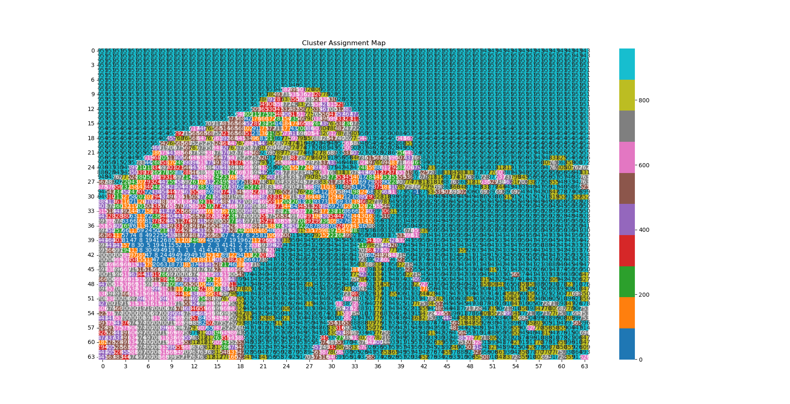
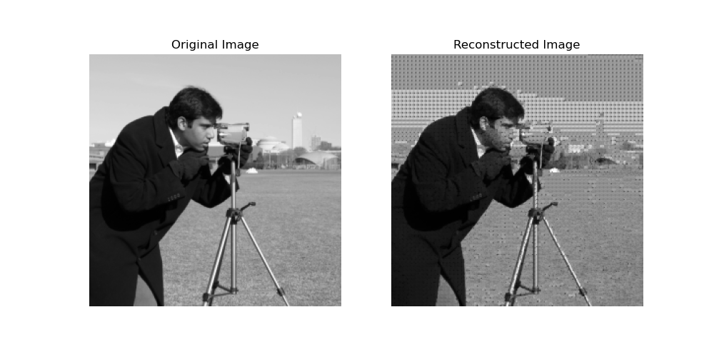

# ARTNN-Image-Reconstruction

This undertaking involved implementing a two layer **Adaptive Resonance Theory Neural Network (ARTNN)** in Python. The ARTNN utilizes unsupervised learning, or learning patterns and classifying output without labels by testing each new pattern it encounters against existing ones.  

First, I tested the network on MNIST handwritten digit classification. The network achieved effective performance after implementing complement coding, or doubling the input vector by adding its logical complement. This step occurs before the input is passed through the network's choice function to ensure it learns not only what is present but what is absent in each sample.  

## Data Loading and Preprocessing

Several images are loaded and preprocessed in Python; each is normalized and divided into "blocks" that fill the space but do not overlap. Each block is then flattened into a vector of pixel values and fed into the the ARTNN before being given a unique cluster index depending on its membership. This process is repeated until no new clusters are created or an arbitrary number of iterations are completed. These cluster maps are visualized with heatmaps to give a high-level overview of how the network is defining and grouping sets of pixels. An example mapping is illustrated below:  

**Run-length encoding (RLE)** and **run-length decoding (DLE)** are then used to replace consecutive repeated values with single values alongside their counts, and reconstruct the original sequences, respectively.

## Results

The original image responsible for the cluster map above is displayed here alongside its reconstruction:  

.

For other results with a low and medium complexity image and a more detailed overview of the network see the attached pdf: **ECE 550 ARTNN Application**.pdf

